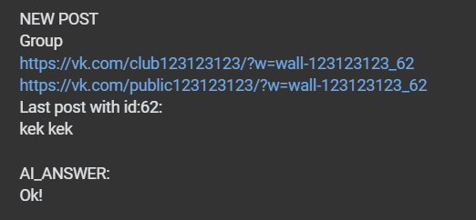

# VK SRALKA

## Description
This is a simple VK bot.   
Bot can:   
 - check VK groups posts 
 - write comments at these posts


## Installation
1. Clone this repository
2. Install requirements
```bash
pip install -r requirements.txt
```
3. Create .env file in the root of the project 
4. Add information to file like in .env.example
5. Create ai_config.py file in the root of the project
6. Add information to file like in ai_config_example.py
7. Run the bot
```bash
python sralka.py
```

## Image example 


